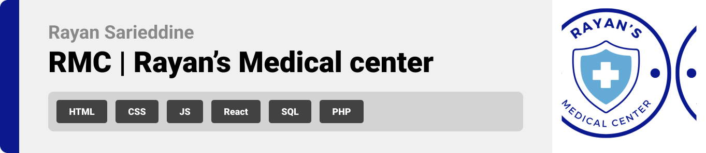

  

<!-- project philosophy -->

## Hospital Management System.

Using Vanilla PHP for the backend and React for the frontend. Including JWT (JSON Web Tokens) authentication and authorization using Axios for API interactions.

admin:
rayan@gmail.com
password

doctor:
salim@gmail.com
salimpassword

patient:
kamal@gmail.com
kamalpassword

Admin: Manage doctors and patients (CRUD operations), approve or deny any new patients going through the emergency room. Assign patients into rooms that are free in the hospital.  
Doctor: View patient records, can be assigned to a patient, can prescribe medications to the patient and can manage appointments on a calendar of availabilities.  
Patient: View personal medical history and appointments, manage upcoming appointments (on the calendar), and book/cancel appointments (on the calendar).

  

### `npm start`

Runs the app in the development mode.\
Open [http://localhost:3000](http://localhost:3000) to view it in your browser.

The page will reload when you make changes.\
You may also see any lint errors in the console.

<!-- Prototyping -->

| 
